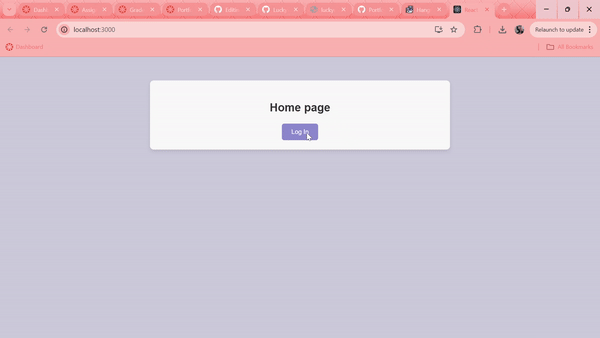
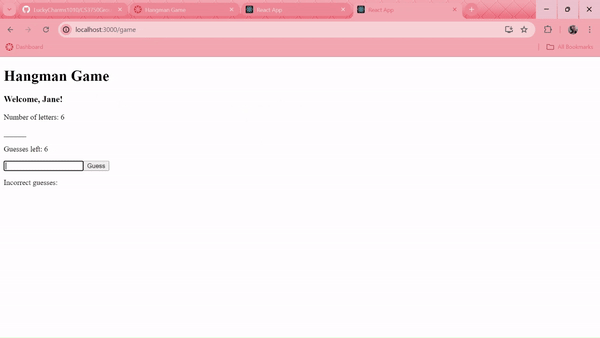
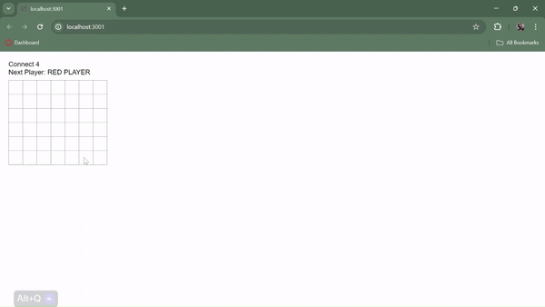

## Welcome to my Portfolio ##
Hi, I’m **Luckkana Phonharath**, an undergraduate **Computer Science** major at **Weber State University.**

## Projects ##
## [Banking Application]([https://github.com/LuckyCharms1010/LuckyCharms1010.github.io/tree/main/BankingApp/Banking-App-main])

Description
 A basic banking application into a fully developed, role-based system using a React frontend and a MongoDB/Node.js/Express backend. The application supports three different roles: Customer, Employee, Administrator. Each with taliored access and features.

 

Frontend:
- **User Authentication**:
  - Implemented a secure login system requiring a username, password, and verification of credentials.
- **Role Management**:
  - Enabled Administrators to control user roles, allowing for the promotion or demotion of users across Customer, Employee, and Administrator levels.
- **Account Management**:
  - Customers can efficiently manage savings, checking, and investment accounts, with options to deposit, withdraw, and transfer funds. Employees are also empowered to perform these actions on behalf of any customer.
- **Transaction History**:
  - Added functionality to display both overall and individual transaction histories, with detailed information on transaction dates and specifics.
- **Custom UI Design**:
  - Designed a professional and cohesive user interface using custom CSS, ensuring that all elements are well-aligned and visually appealing."

Backend:
- Backend routes and session management to control front-end functionalities, role-base access
- Implemented password hashing using SHA-256 to ensure the passwords that are stored in the database are shown only the hashed password.

##[HangMan]([https://github.com/LuckyCharms1010/LuckyCharms1010.github.io/tree/main/Hangman/CS3750Group-Skittles-HangMan-Assignment-main])

Description
  A full-stack Hangman game using React for the front end, Express for the backend, and MongoDB for data storage. The game was designed with both user engagement and fair play in mind, ensuring a fun and challenging experience for players.

Game Logic:
  Users will first create a name that will be used to create a sessions. If user wins based on the session name, it will store the name to the highscore board if the user it in the top 10 for least amount of guesses. Game plays as traditional hangman. If user guesses the correct letter, the letter will show, if incorrect, user will get a strike. Once game is over, the user will be asked if they want to play again, if no, the session will be deleted ensuring that the same name is not overlapped with a new name.

##[Connect4]([https://github.com/LuckyCharms1010/LuckyCharms1010.github.io/tree/main/Connect4/Four%20in%20a%20Row%20Game])

  a basic tic-tac-toe example into a fully functional Connect Four game using React. The assignment focused on learning and applying React concepts while building a classic board game.

Game Logic:

- **6x7 Board Layout**:
    - The game features a 6-row by 7-column board where players can drop their tiles into any column with available space.
- **Tile Dropping Mechanism**:
    - Clicking on a column causes the tile to drop into the lowest available spot. If the column is full, the click does nothing.
Winning and Tie Detection: The game automatically detects and announces a winner when four tiles align horizontally, vertically, or diagonally. It also recognizes and declares a tie if the board fills up without a winner.
- **Turn Management**:
    - The game seamlessly switches turns between players after each tile placement.
- **Additional Features**:
    - React Learning Focus: While the game is fully functional, the emphasis was on mastering React, with a simpler, non-animated UI.

### Summary:
This project demonstrates my ability to implement game logic in React, manage state, and create an interactive user experience.
  

  
